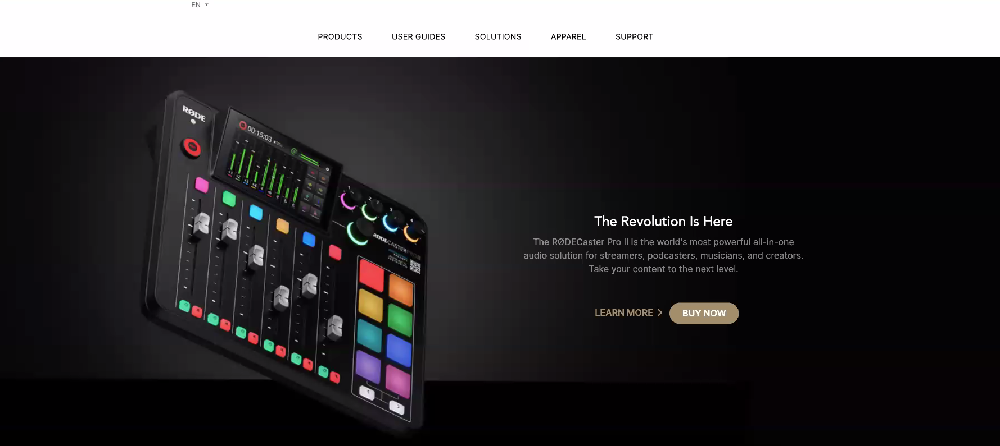

# Full Stack JS Tailwind Assignment 
# Rode Clone

## Project  [Live Link](https://rode-clone-tailwind-project.netlify.app/)

-   What i learnt in this project
   - learnt tailwind css and its properties 
   - learned how to work with responsiveness in tailwind css

---
#### Screenshot

